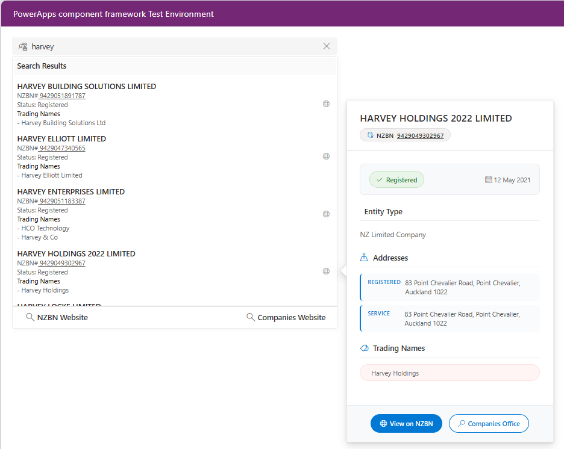

# PCF FluentUI Autocomplete Boilerplate.

PCF FluentUI Autocomplete to create a dynamic lookup from any API source. This is a boilerplate only and you will need to edit the API endpoint to a data point of your choosing.  The API I have used in this example will need an API key before it will work, but this is designed to give you an example.

The object of the project was to have a dynamic API lookup built on React and is styled to replicate out of the box components from Microsoft. 

This example has alot of console.debug values being pumped out, feel free to remove these for your production component.

---

## Screenshots

The following screenshots demonstrate the key features and functionality of the PCF FluentUI AutoComplete component:

### Main Interface

*The main autocomplete interface showing search functionality, dropdown results with entity details, and interactive hover cards displaying comprehensive business information including addresses, trading names, and direct links to external resources.*

---

## How to obtain an NZBN Api Key for this project as is

You will need to obtain a token from the [https://portal.api.business.govt.nz/](https://portal.api.business.govt.nz/) first.

The auto complete will populate only the primary bound field, it is expected that you build this project out to fit your needs, personally I only store a minimum amount of data using this PCF control, and the rest of the data is populated nightly via a MS Flow that check the status of all companies stored in our Dynamics Instance.

This is intended to be a community driven project, so any suggestion are welcome.

---

## ToDo List

- [x] Fix issue with multipul re-draws
- [x] Fix issue with clear function, works but need to hit twice.
- [x] Add hover card functionality with detailed entity information
- [x] Improve TypeScript type safety with proper interfaces
- [x] Fix loading state management for better UX
- [ ] Fix CSS for animated underline (anyone one know how to do this let me know, not a css expert.)

---

## Change Log

- 26/07/25 - Added hover card functionality that displays detailed entity information when hovering over search results
- 26/07/25 - **Modular Architecture**: Extracted hover card functionality into separate reusable component (EntityHoverCard.tsx)
- 26/07/25 - **TypeScript Enhancement**: Added comprehensive type definitions with EntityDetailTypes.ts for full type safety
- 26/07/25 - **Interactive Hover Cards**: Added clickable links in hover cards with proper external navigation
- 26/07/25 - Improved TypeScript type safety with proper interfaces for EntityItem, TradingName, and ApiResponse
- 26/07/25 - Fixed loading state management by converting from useRef to useState for proper re-rendering
- 26/07/25 - Added debounced hover API calls with 300ms delay to prevent excessive requests
- 26/07/25 - Fixed function name typo (handelSearch → handleSearch) and CSS calc() function
- 26/07/25 - Added constants for magic numbers (DEBOUNCE_DELAY, MIN_SEARCH_LENGTH, etc.)
- 26/07/25 - Enhanced error handling with try-catch blocks and proper logging
- 14/04/23 - Added loading spinner to search results, this will show your user if the component is still awaiting on the API to respond.
- 14/04/23 - Rearranged control and placed suggestion inside the affect hos on the debounceValue change. Also fixed issue with wiping values.
- 11/04/23 - Added useHocks-ts lib to project. [usehooks-ts package](https://www.npmjs.com/package/usehooks-ts)
- 06/04/23 - Added a debounce feature to limit api calls while typing. NB I have probably over complicated this.
- 04/04/23 - Added is disabled to SearchBox props & updated FabricUi packages.
- 04/04/23 - Amended CSS for focusZoneContainer to include zIndex: 9 to overlay from other components.

---

## Features

### Core Functionality

- **Dynamic API Lookup**: Real-time search with configurable API endpoints
- **Debounced Search**: 500ms delay to optimize API calls while typing
- **Loading States**: Visual feedback during API requests with spinners
- **Keyboard Navigation**: Full keyboard support with FluentUI FocusZone
- **Responsive Design**: Adapts to container width with proper positioning

### Enhanced User Experience

- **Hover Cards**: Detailed entity information displayed on hover with 300ms delay
- **External Links**: Quick access to NZBN and Companies Office websites
- **Clear Function**: Easy search reset with proper state management
- **Error Handling**: Graceful handling of API failures with user feedback

### Technical Features

- **TypeScript Support**: Fully typed with proper interfaces and type safety
- **React Hooks**: Modern React patterns with useState, useRef, and useEffect
- **FluentUI Components**: Consistent Microsoft design system integration
- **Accessibility**: ARIA compliant with proper focus management and tooltips

## Project Structure

- **AutoComplete.tsx** - Main autocomplete component with search functionality
- **EntityHoverCard.tsx** - Reusable hover card component for displaying entity details
- **EntityDetailTypes.ts** - TypeScript type definitions for NZBN API responses
- **Queries.tsx** - Additional query utilities (if needed)

## Architecture

The component is designed with separation of concerns:

1. **Main Component (AutoComplete.tsx)**: Handles search logic, API calls, and user interactions
2. **Hover Card Component (EntityHoverCard.tsx)**: Dedicated component for displaying detailed entity information
3. **Type Definitions (EntityDetailTypes.ts)**: Comprehensive TypeScript interfaces ensuring type safety

---

## Deprecated PCF Controls

[PCF-NZPost-AutoComplete](https://github.com/garethcheyne/PCF-NZPost-AutoComplete)

[PCF-NZBN-AutoComplete](https://github.com/garethcheyne/PCF-NZBN-AutoComplete)

---

### Disclaimer

THE SOFTWARE IS PROVIDED "AS IS", WITHOUT WARRANTY OF ANY KIND, EXPRESS OR
IMPLIED, INCLUDING BUT NOT LIMITED TO THE WARRANTIES OF MERCHANTABILITY,
FITNESS FOR A PARTICULAR PURPOSE AND NONINFRINGEMENT. IN NO EVENT SHALL THE
AUTHORS OR COPYRIGHT HOLDERS BE LIABLE FOR ANY CLAIM, DAMAGES OR OTHER
LIABILITY, WHETHER IN AN ACTION OF CONTRACT, TORT OR OTHERWISE, ARISING FROM,
OUT OF OR IN CONNECTION WITH THE SOFTWARE OR THE USE OR OTHER DEALINGS IN THE
SOFTWARE.