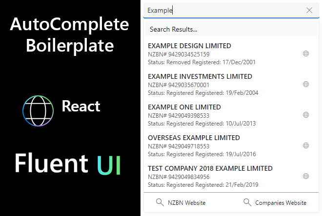

# PCF FluentUI Autocomplete Boilerplate.

PCF FluentUI Autocomplete to create a dynamic lookup from any API source. This is a boilerplate only and you will need to edit the API endpoint to a data point of your choosing.  The API I have used in this example will need an API key before it will work, but this is designed to give you an example.

The object of the project was to have a dynamic API lookup built on React and is styled to replicate out of the box components from Microsoft. 

This example has alot of console.debug values being pumped out, feel free to remove these for your production component.

---

## How to obtain an NZBN Api Key for this project as is.
You will need to obtain a token from the [https://portal.api.business.govt.nz/](https://portal.api.business.govt.nz/) first.

The auto complete will populate only the primary bound field, it is expected that you build this project out to fit your needs, personally I only store a minimum amount of data using this PCF control, and the rest of the data is populated nightly via a MS Flow that check the status of all companies stored in our Dynamics Instance.

This is intended to be a community driven project, so any suggestion are welcome.

---

## ToDo List
- [x] Fix issue with multipul re-draws
- [ ] Fix issue with clear function, works but need to hit twice.
- [ ] Fix CSS for animated underline (anyone one know how to do this let me know, not a css expert.)

---

## Change Log
- 04/04/23 - Added is disabled to SearchBox props & updated FabricUi packages.
- 04/04/23 - Amended CSS for focusZoneContainer to include zIndex: 9 to overlay from other components.
- 06/04/23 - Add a debounce feature to limit api calls while typing. NB I have probably over complicated this.
- 11/01/23 - Added useHocks-ts lib to project. [Link](https://www.npmjs.com/package/usehooks-ts)

## Depercated PCF Controls.
[PCF-NZPost-AutoComplete](https://github.com/garethcheyne/PCF-NZPost-AutoComplete)

[PCF-NZBN-AutoComplete](https://github.com/garethcheyne/PCF-NZBN-AutoComplete)

---

### Disclaimer
THE SOFTWARE IS PROVIDED "AS IS", WITHOUT WARRANTY OF ANY KIND, EXPRESS OR
IMPLIED, INCLUDING BUT NOT LIMITED TO THE WARRANTIES OF MERCHANTABILITY,
FITNESS FOR A PARTICULAR PURPOSE AND NONINFRINGEMENT. IN NO EVENT SHALL THE
AUTHORS OR COPYRIGHT HOLDERS BE LIABLE FOR ANY CLAIM, DAMAGES OR OTHER
LIABILITY, WHETHER IN AN ACTION OF CONTRACT, TORT OR OTHERWISE, ARISING FROM,
OUT OF OR IN CONNECTION WITH THE SOFTWARE OR THE USE OR OTHER DEALINGS IN THE
SOFTWARE.